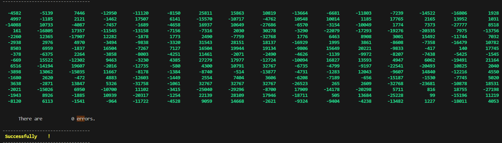
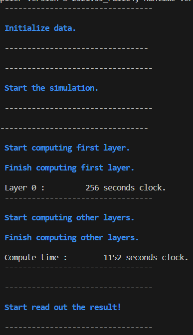
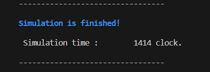
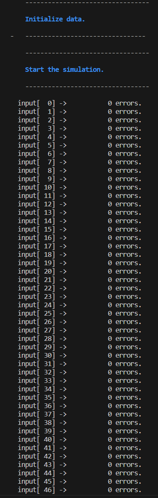
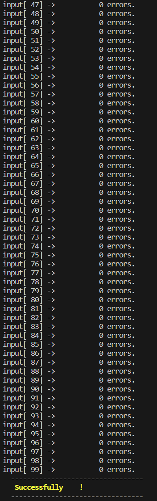

# 8-MLPs Accelerator
*Author：宁斌 倪兆君*     
*Data：20230511*
## 设计运行说明
- 在project文件夹下运行，make
- 设计文件：./design/
- 文件类型:.sv(systemverilog)
- 顶层测试文件：./testbench/top_testcase_tb.sv
## 架构说明
- 本架构主要目标：节省时钟数
- 时间瓶颈：输入输出数据带宽为32
- 设计理论上的最小时间：
  - 数据输入时间 = weight时间 + input时间 + 输出数据时间 = 1280 clocks 
  - weight时间  = 8层 * 16 * 16 * 16bit / 32bit = 1024 clocks 
  - input时间   = 16 * 16 * 16bit / 32bit = 128 clocks
  - 数据输出时间 = 16 * 16 * 16bit / 32bit = 128 clocks
- 采用2*16 的计算矩阵，数据流采用广播的形式
## Top
端口说明  

    input                     clk                  时钟
    input                     rst_n                复位
    input                     load_en_i,           数据输入使能
    input  [31:0]             load_payload_i       输入数据
    input                     load_type_i          数据类型（input-1,weight-0）
    input  [ 3:0]             input_load_number    输入input行号（0-15）
    input  [ 2:0]             layer_number         输入weight层数（0-7）
    input  [ 3:0]             weight_number        输入input行号（0-7）
    output                    result_valid_o       输出有效
    output [31:0]             result_payload_o     输出数据
## pe_array——module
端口说明

    parameter                  col = 16             计算矩阵列
    parameter                  row = 2              计算矩阵行
    input  [255:0]             data_input_matrix    input数据（16bit*16）
    input  [ 31:0]             data_weight_matrix   weight数据（16bit*2.一列数据中的两个）
    input  [  3:0]             add_number           weight的行数/2 
    input                      rounder_en           round使能
    input                      keep                 内部reg保持，在input连续8拍时使用
    output [  1:0][15:0][15:0] pe_array_out         数据输出（round后）
    output                     rounder_valid        输出有效      
    output [  3:0]             round_number         输出行数/2

# RTL 运行结果
## 时间
- 总时间：1414 clock
- 计算时间：1152 clock
## 数据输出对比

**ALL RIGHT！**
## 运行过程
  

 
## 100个input的测试
  

 
