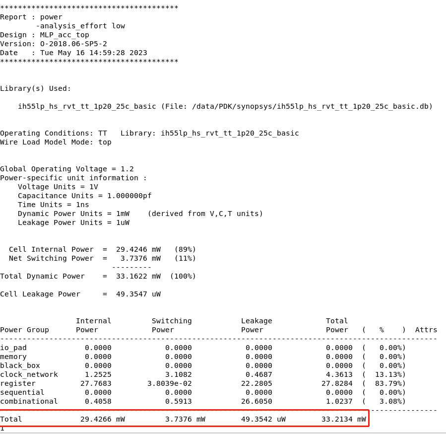

# EE218——VLSI 2023-Finalproject
- Shanghaitech Univ.
- *Author：宁斌 倪兆君*     
- *Data：20230518*
# 8-MLPs Accelerator
## 设计要求
 Design Specification
1. The size of all matrices is fixed to 16 × 16 and the number of layers of the MLP computation is
fixed to 8 (n = 8). Each input and output value is a 16-bits signed fix-point number: 7 bits for
integer part including sign bit and 9 bits for fraction part.
2. The input and output data bandwidths are limited to 32 bits per cycle.
3. The input matrix of each layer should be rounded to the 16-bits signed fix-point number. You
should implement rounding operations of saturation and round-to-nearest to HighBit and LowBit
respectively. Please only round the final result of each layer, which means you should maintain
full precision calculations during the multiply-add computation.
4. TAs will provide SRAM blocks of several sizes, the data-width includes 16 and 32 bits and the
word-count includes 128, 256, 512 and 1024. You can instantiate these SRAM blocks if your
design needs large blocks of memory.
5. The process of reading data into the module is simplified. However, during each complete
calculation (input a single I−1 to output corresponding I7), all weight and input parameters
outside the module can only be read once at most.

__Another Work：https://github.com/jackbang/MulAdd_Acc__
## Design  Structure

Since the main bottleneck of this project is the input data bandwidth (32bit), we use a 2*16PE array with the same Input data for the same columns and the same weight data for the same rows. Such a structure can effectively solve the limitation of too small input data bandwidth. When inputting input data, wait for eight clock cycles to load all 16 data into it, while the weight data can be used for calculation immediately after input. Only the first of the eight MLPs requires input data to be read from a *.txt* file.


The PE unit has a three-stage structure, including a multiplier, an adder, and a rounder. the most important thing is that there are 16 registers after the adder, so that the adder results can be stored in different registers depending on the weight.


## 设计运行说明
- 在project文件夹下运行，make
- 设计文件：./design/
- 文件类型:.sv(systemverilog)
- 顶层测试文件：./testbench/top_testcase_tb.sv
## 架构说明

- 本架构主要目标：节省时钟数
- 时间瓶颈：输入输出数据带宽为32
- 设计理论上的最小时间：
  - 数据输入时间 = weight时间 + input时间 + 输出数据时间 = 1280 clocks 
  - weight时间  = 8层 * 16 * 16 * 16bit / 32bit = 1024 clocks 
  - input时间   = 16 * 16 * 16bit / 32bit = 128 clocks
  - 数据输出时间 = 16 * 16 * 16bit / 32bit = 128 clocks
- 采用2*16 的计算矩阵，数据流采用广播的形式
## Top
端口说明  

    input                     clk                  时钟
    input                     rst_n                复位
    input                     load_en_i,           数据输入使能
    input  [31:0]             load_payload_i       输入数据
    input                     load_type_i          数据类型（input-1,weight-0）
    input  [ 3:0]             input_load_number    输入input行号（0-15）
    input  [ 2:0]             layer_number         输入weight层数（0-7）
    input  [ 3:0]             weight_number        输入input行号（0-7）
    output                    result_valid_o       输出有效
    output [31:0]             result_payload_o     输出数据
## pe_array——module
端口说明

    parameter                  col = 16             计算矩阵列
    parameter                  row = 2              计算矩阵行
    input  [255:0]             data_input_matrix    input数据（16bit*16）
    input  [ 31:0]             data_weight_matrix   weight数据（16bit*2.一列数据中的两个）
    input  [  3:0]             add_number           weight的行数/2 
    input                      rounder_en           round使能
    input                      keep                 内部reg保持，在input连续8拍时使用
    output [  1:0][15:0][15:0] pe_array_out         数据输出（round后）
    output                     rounder_valid        输出有效      
    output [  3:0]             round_number         输出行数/2

# RTL 运行结果
## 时间
- 总时间：1414 clock
- 计算时间：1152 clock
## 数据输出对比

**ALL RIGHT！**
## 运行过程
  

 
## 100个input的测试
  

 

# DC综合
## DC Schematic


The orange box is our processing element. There is a 16×2 PE array.

## DC constrain

```shell
# ----------------------CLEANUP----------------------------
reset_design

# ----------------------CLOCK------------------------------
set INT_CLK_PERIOD 5
set CLK_MAX_LATENCY_SOURCE 	[expr {0.15  * $INT_CLK_PERIOD}]
set CLK_MAX_LATENCY 		[expr {0.1   * $INT_CLK_PERIOD}]
set CLK_TRANSITION  		[expr {0.025 * $INT_CLK_PERIOD}]
set CLK_UNCERTAINTY 		[expr {0.15  * $INT_CLK_PERIOD}]

# ------------------Internel clock---------------------------
create_clock -period $INT_CLK_PERIOD -name Int_clk [get_ports clk]
set_clock_uncertainty -setup $CLK_UNCERTAINTY [get_clocks Int_clk]
set_clock_latency -source -max $CLK_MAX_LATENCY_SOURCE [get_clocks Int_clk]
set_clock_latency -max $CLK_MAX_LATENCY [get_clocks Int_clk]
set_clock_transition $CLK_TRANSITION [get_clocks Int_clk]

# ------------------Set dont touch----------------------------
set_dont_touch_network [get_ports clk]
set_dont_touch_network [get_ports rst_n]

# --------------------Input Path-------------------------------
set All_input [remove_from_collection [all_inputs] [get_ports {clk rst_n}]]
set_input_delay -max [expr {0.3 * $INT_CLK_PERIOD}] -clock Int_clk $All_input
set_input_delay -min [expr {0.06 * $INT_CLK_PERIOD}] -clock Int_clk $All_input

# -------------------Output Path--------------------------------
set_output_delay -max [expr {0.7 * $INT_CLK_PERIOD}] -clock Int_clk [all_outputs]

# ----------------------AREA------------------------------------
set_max_area 0

# -----------------Environment attributes------------------------
set_load 0.03 [all_outputs]

# ---------------------Fanout--------------------------------------
set_max_fanout 300 [current_design]
```

The frequency of our design is **200MHz**. To get the reasonable synthesis result, we set constrain parameters as the following:

1.  The sum of the maximum input and output delay is not less than the clock period. 
2.  Fix the maximum clock latency as 10% of  the clock period. 
3.  Fix the clock transition time as 2.5% of the clock period. 
4.  Fix the clock uncertainty time as 15% of the clock period.
5.  Use set_dont_touch to ignore the clock port or net.

## DC Area Report


## DC Timing Report


## DC Power Report



## Formality Result


## Pre-syn VCS Simulation

**Overview:** 

Since the output is 32 bits, to take full advantage of the bit width, we output two 16-bit numbers simultaneously. In order to make it easier to observe and compare whether the output values are correct, we make full use of the features of SystemVerilog, and the function of printing the compared results is built into the testbench. The outputs of the last layer are compared one by one, and if correct, the output values are printed in green, otherwise red. At the same time, our testbench can also count the number of errors and the number of clock cycles.

In the stage of post-syn VCS simulation, we use the similar procedure.

**Input files:**


**Makefile:**


**Simulation Result:**


**Input description:**

We use the 32-bit port **load_payload_i** to load input and weight. As is shown below, in stage 1/16,we first use 8 cycles to load 16 16-bit input data to feed the columns of our 16×2 PE array. Then we use another 8 cycles to load weight data. At each cycle we sent the high-16-bits weight data to the first row of our 16×2 PE array. Then we sent the rest 16-bits weight data  to the second row of our 16×2 PE array. At this time, we finish stage 1 of total 16 stages for loading data.


**Simulation Waveform:**


The output is the same with the reference golden result. Our testbench has completed comparison and can prove that the whole output values are all correct.


## Post-syn VCS Simulation

**Input files:**


**Makefile:**

The same with the pre-syn VCS simulation stage. Just modify the inpurt files (filelist.f) above.

**Simulation Result:**


**Simulation Waveform:**


The output is the same with the reference golden result. Our testbench has completed comparison and can prove that the whole output values are all correct.
